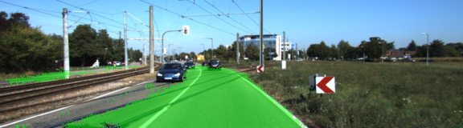
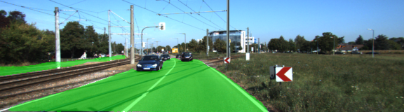
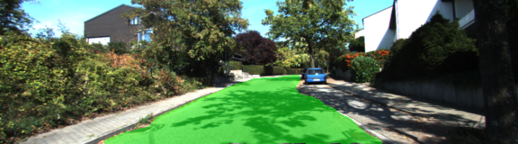
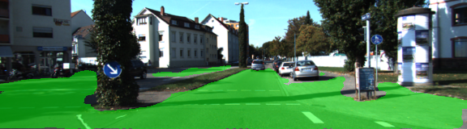
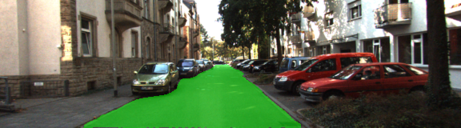
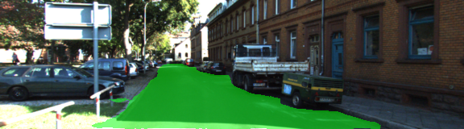
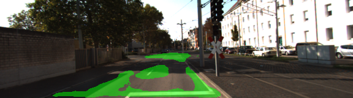

# Self-Driving Car Engineer Nanodegree Program
# Semantic Segmentation Project

## Introduction
In this project, the main objective is to label the pixels of a road in images using a Fully Convolutional Network (FCN). This will be implemented by a FCN based on the [FCN-8 architecture](https://people.eecs.berkeley.edu/~jonlong/long_shelhamer_fcn.pdf) using VGG16 encoder trained for image classification. 

## Implementation

The neural network is built in the *layers* method in `main.py`. The architecture is implemented as follows:

```python
    # Convolutional 1x1 layer for VGG's layer 7
    l7_conv1x1   = get_convolution2D(vgg_layer7_out, num_classes)
    # Deconvolutional layer with kernel size = 4 and stride = 2.
    l7_upsample1 = get_convolution2D_transpose(l7_conv1x1, num_classes, 4, strides = (2, 2))
    # Convolutional 1x1 layer for VGG's layer 4
    l4_conv1x1   = get_convolution2D(vgg_layer4_out, num_classes)
    # Skip layer adding the VGG's layers 7 and 4
    l4_skip      = tf.add(l7_upsample1, l4_conv1x1)
    # Deconvolutional layer with kernel size = 4 and stride = 2.
    l4_upsample2 = get_convolution2D_transpose(l4_skip, num_classes, 4, strides = (2, 2))
    # Convolutional 1x1 layer for VGG's layer 3
    l3_conv1x1   = get_convolution2D(vgg_layer3_out, num_classes)
    # Skip layer adding the VGG's layers 4 and 3
    l3_skip      = tf.add(l4_upsample2, l3_conv1x1)
    # Deconvolutional layer with kernel size = 16 and stride = 8.
    l3_upsample3 = get_convolution2D_transpose(l3_skip, num_classes, 16, strides = (8, 8))
```
The convolutional 1x1 layers were created using a random normal initializer with a STD of 0.01, and a L2 kernel initializer with a value of 1e-3.

```python
def get_convolution2D(previous_layer, num_classes):
    # returns a 2D convolution
    initializer = tf.random_normal_initializer(stddev = STD_DEV_INITIALIZER)
    regularizer = tf.contrib.layers.l2_regularizer(REGULARIZER_WEIGHT)
    conv        = tf.layers.conv2d(
        previous_layer, 
        num_classes, 
        1, 
        padding = DEFAULT_PADDING, 
        kernel_initializer = initializer, 
        kernel_regularizer = regularizer)
    return conv 
```
An Adam optimizer is used after the construction of the NN:

```python
def optimize(nn_last_layer, correct_label, learning_rate, num_classes):
    """
    Build the TensorFLow loss and optimizer operations.
    :param nn_last_layer: TF Tensor of the last layer in the neural network
    :param correct_label: TF Placeholder for the correct label image
    :param learning_rate: TF Placeholder for the learning rate
    :param num_classes: Number of classes to classify
    :return: Tuple of (logits, train_op, cross_entropy_loss)
    """
    logits             = tf.reshape(nn_last_layer, (-1, num_classes))
    correct_label      = tf.reshape(correct_label, (-1,num_classes))
    cross_entropy_loss = tf.reduce_mean(tf.nn.softmax_cross_entropy_with_logits(logits= logits, labels= correct_label))
    optimizer          = tf.train.AdamOptimizer(learning_rate= learning_rate)
    train_op           = optimizer.minimize(cross_entropy_loss)

    return logits, train_op, cross_entropy_loss
```

The network is trained using the [Kitti Road dataset](http://www.cvlibs.net/datasets/kitti/eval_road.php), with the following parameters:

```python
LEARNING_RATE  = 0.00050
KEEP_PROB         = 0.5
EPOCHS              = 50
BATCH_SIZE        = 5
```

The learning rate was raised from the initial 0.00001, which yielded more exact results and less noise in the images, as can be seen in the next images:



*Result on training on 50 epochs using a 0.00001 learning rate*



*Result on training on 50 epochs using a 0.00050 learning rate*

The model loss decreases over time, until it gets stable around 44 epochs.

Epoch : 49 / 50 - loss: 0.021773 - Time: 0:00:53.528992

Epoch : 50 / 50 - loss: 0.038319 - Time: 0:00:53.575552

*Training finished. Training time: 0:44:49.083013*

## Image Results

The images are clearly segmented by the road, the NN did a good job clearly differentating the rest of the objects. 

 

 

 

 

However, in a few images the NN couldn't classify correctly the road. This can be improved by augmenting the data (by generating new images from the ones in the set).

 

## Other Project Details
### Setup
##### Frameworks and Packages
Make sure you have the following is installed:
 - [Python 3](https://www.python.org/)
 - [TensorFlow](https://www.tensorflow.org/)
 - [NumPy](http://www.numpy.org/)
 - [SciPy](https://www.scipy.org/)
##### Dataset
Download the [Kitti Road dataset](http://www.cvlibs.net/datasets/kitti/eval_road.php) from [here](http://www.cvlibs.net/download.php?file=data_road.zip).  Extract the dataset in the `data` folder.  This will create the folder `data_road` with all the training a test images.

### Start
##### Implement
Implement the code in the `main.py` module indicated by the "TODO" comments.
The comments indicated with "OPTIONAL" tag are not required to complete.
##### Run
Run the following command to run the project:
```
python main.py
```
**Note** If running this in Jupyter Notebook system messages, such as those regarding test status, may appear in the terminal rather than the notebook.

### Submission
1. Ensure you've passed all the unit tests.
2. Ensure you pass all points on [the rubric](https://review.udacity.com/#!/rubrics/989/view).
3. Submit the following in a zip file.
 - `helper.py`
 - `main.py`
 - `project_tests.py`
 - Newest inference images from `runs` folder  (**all images from the most recent run**)
 
 ## How to write a README
A well written README file can enhance your project and portfolio.  Develop your abilities to create professional README files by completing [this free course](https://www.udacity.com/course/writing-readmes--ud777).
